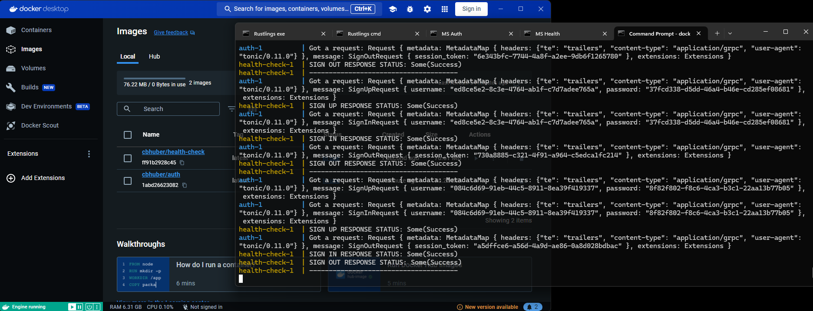

# Authentication Microservices App

A microservice app consisting of 2 services, an authentication service and a health check service. A client is also developed that can communicate with the auth service.



The auth service has three primary features:
1. Sign in
2. Sign up
3. Sign out

## Components
* Designing, building, and deploying microservices
* Using [gRPC](https://grpc.io/) & [Protocal Buffers (A.K.A Protobufs)](https://protobuf.dev/) to communicate between microservices
* Monitoring the health of microservices
* Setting up continuous integration & continuous deployment
* Using session based authentication
* Writing testable code, fully complete with unit tests for CI
* Organizing code using modules

## Terminologies

__Session based authentication__

[Session based auth](https://www.geeksforgeeks.org/session-vs-token-based-authentication/) works by giving the client a session token which can be used in subsequent requests to authenticate the user.

__Microservices__

[Microservices](https://microservices.io/) is an architectural style that structures an application as a collection of services that are independently deployable, loosely coupled, organized around business capabilities, and owned by a small team.

__CI/CD__

[CI/CD](https://www.redhat.com/en/topics/devops/what-is-ci-cd) (Continuous Integration/Continuous Delivery or Continuous Deployment) is a set of practices and techniques that help software development teams deliver high-quality software faster and more reliably. Continuous Integration refers to the process of frequently merging code changes from multiple developers into a central repository and running automated tests to detect any integration issues early on. Continuous Delivery/Deployment takes this a step further, automating the entire software release process, from building and testing to deploying the application to production. These practices help teams deliver software more frequently and with higher quality, reducing time-to-market and increasing customer satisfaction.

## Third Party Libraries

Rust has a minimal runtime, which means several third-party libraries are used to implement the app.

### tokio

[tokio](https://tokio.rs/) is an asynchronous runtime for the Rust programming language. It provides the building blocks needed for writing network applications.

### tonic, prost, and tonic-build

[tonic](https://crates.io/crates/tonic) is a Rust implementation of gRPC. It is composed of three main components: the generic gRPC implementation, the high performance HTTP/2 implementation and the codegen powered by [prost](https://crates.io/crates/prost).

[tonic-build](https://crates.io/crates/tonic-build) is a development dependency that is inside the build script to compile proto files via `prost` and generate service stubs and proto definitions for use with tonic.

### pbkdf2 & rand_core

[pbkdf2](https://crates.io/crates/pbkdf2) and [rand_core](https://crates.io/crates/rand_core) are used to hash passwords.

### uuid

[uuid](https://crates.io/crates/uuid) is used to generate unique identifies for each user. It is also used within tests to generate unique strings.

### clap

[clap](https://crates.io/crates/clap) is a command-line parser. It will be used to create our stand alone client.

## Setup

1. [Protoc](https://grpc.io/docs/protoc-installation/)
2. [Cargo Watch](https://github.com/watchexec/cargo-watch)
3. [Docker](https://docs.docker.com/get-docker/)
4. [Docker Hub](https://hub.docker.com/) (Create an account)

Running and watching for changes:

```bash
cargo watch -c -q -w src/auth-service -x "run -q --bin auth"
```
```bash
cargo watch -c -q -w src/health-check-service -x "run -q --bin health-check"
```

## Execution
`docker-compose up`
Press `CTRL-C` in your terminal window to stop the services.